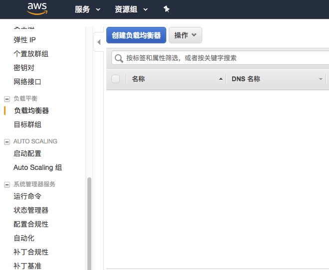
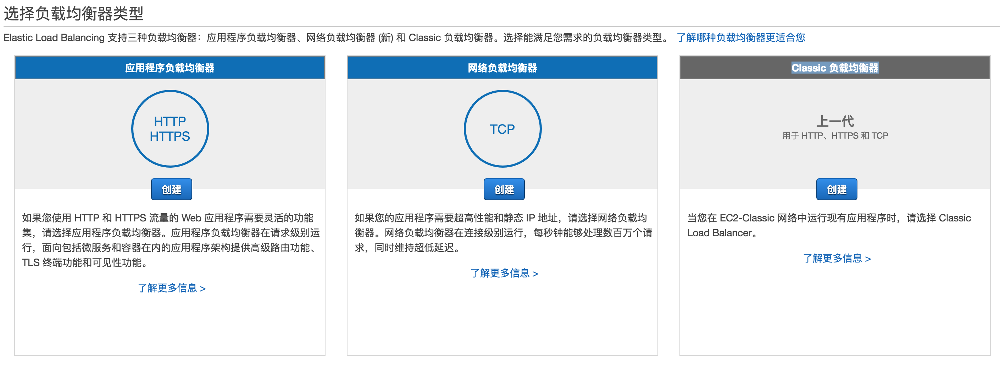
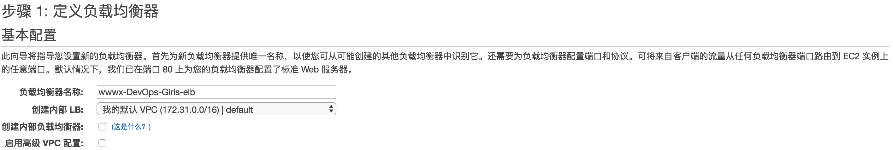
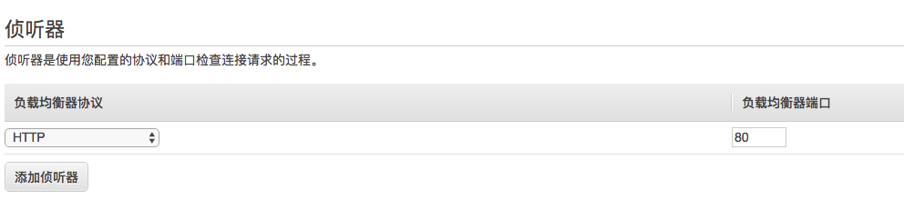
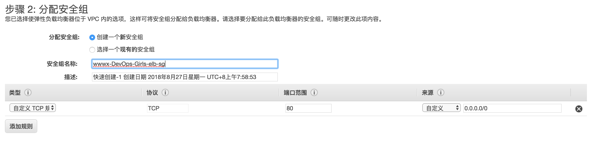
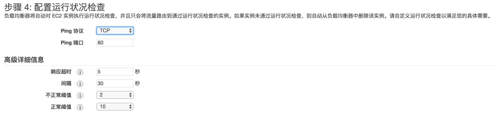
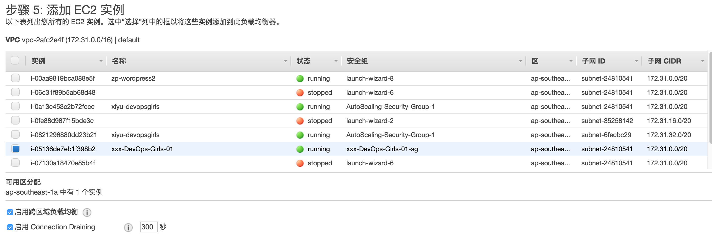
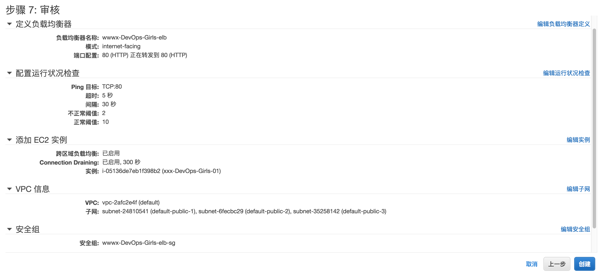
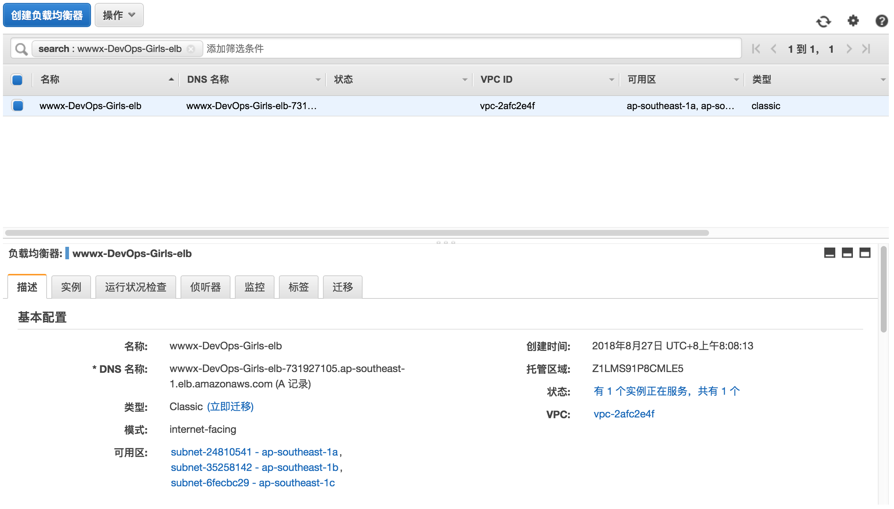

# 负载均衡和高可用性

## 关键概念

在我们开始之前，先看几个概念：

- 负载均衡器将流量转发给一个或多个服务提供商。这意味着你可以将多个提供相同内容的EC2实例作为一个服务。

- 高可用性意味着你的系统可以在一段时间内保持正常地运行。当系统发生故障时，采用故障转移会使你的系统更加高可用。

- 服务分离是指确保多个相互依赖的系统立存活，并其共享较少的故障模式。

- Artifacts是我们系统的产出物，在这个例子中，Artifacts是修改后的Wordpress包，它对你来说是独一无二的。

让我们开始做吧！

## 我们要做什么

在本次实践课中，我们将要做的有：

- 创建一个具备伸缩性的负载均衡器
- 使用外部的数据库重新安装Wordpress
- 创建一个修改后的Wordpress Artifact，将它上传到S3上
- 使用该Artifact创建另一个实例

## 创建一个具有伸缩性的负载均衡器

### 1.）创建负载均衡器

点击 *服务 > 选择EC2 > 负载均衡器*。 点击“创建负载均衡器”。



### 2.）选择负载均衡器类型

在选择负载均衡器类型的页面，你需要选择`Classic 负载均衡器`。



### 3.) 定义负载均衡器

- 在 `名称` 处写下你的负载均衡器的名字，格式：`你名字拼音-DevOps-Girls-elb`

  其他的保持默认。



### 4.) 设置负载均衡器使用协议

`侦听器`保持不变，仍然是`HTTP` 和 `80`



### 5.) 为负载均衡器创建安全组

选择`创建一个新安全组`选项。与之前为实例创建的安全组类似，相当于设置允许哪种类型的流量通过的防火墙。

命名规则:  `你名字拼音-DevOps-Girls-elb-sg`



除了**来源**选择**我的IP**，其他的配置都保持默认值。

因为我们没有使用HTTPS，跳过`配置安全设置`

### 6.) 配置运行状况检查

负载均衡器将自动对 EC2 实例执行运行状况检查，并且只会将流量路由到通过运行状况检查的实例。

此处我们将协议设置为`TCP`，端口为`80`，其他保持默认即可。



### 7.) 添加 EC2 实例

选中“选择”列中的框以将这些实例添加到此负载均衡器，负载均衡器就会开始将请求路由至目标。



跳过`添加标签`这一步。

### 8.) 最后一步!

检查你的配置无误后，点击 *创建* 按钮。



### 9.) 查看负载均衡器的详细信息

点击跳转到负载均衡器的链接。与实例一样，您将看到一个详细介绍负载均衡器属性的面板。 记下 *DNS名称* ，标记如下。



## 使用RDS重新安装WordPress

因为Wordpress将其URL数据保存在数据库中，所以我们需要重置你的Wordpress。 如果你的SSH会话仍处于打开状态，那么你可以继续使用，否则，请转到此处的SSH说明。

### 12.) 重置WordPress配置

使用`Terminal`或者`Putty`，跳转到Workpress目录，然后删掉`wp-config.php`文件：

```
cd /var/www/html/
sudo rm wp-config.php
```

### 13.) 重置WorkPress数据库

现在，打开浏览器并粘贴步骤11中的 *DNS名称* 。这应该显示一个安装页面。继续安装，但是当你访问到需要提供数据库详细信息的页面时，请输入以下内容：

```
Database Name: devopsgirlsdb
Database User: devopsgirls
Database Password: devopsgirlsrds
Database Host: rds.devopsgirls.internal
Database Prefix: firstname_
```

参考下图：

![Image][2-1-11-wpsql]

记得将'firstname_'替换为你的名字。例如：'Banana Smith'的数据库前缀为'banana'。

### 14.) 安装完成

安装完成，直到转到你Blog Post页面。
现在事情已经准备就绪，我们可以开始推广WordPress制品了。

## 创建制品

### 15.) 复制你的WordPress目录

如果安装顺利，你可以复制已安装的Wordpress目录，这样做你就不必再次运行安装命令。我们通过`Terminal`或`Putty`执行此操作。 我们将使用以下命令：

```
cd /var/www/html/
sudo tar cvfz ~/firstname.lastname-wordpress.tgz .
```

使用此命令，将现在的目录改为安装了WordPress的目录*/var/www/html*。 然后，我们创建一个压缩的tar文件 `firstname.lastname-wordpress.tgz`，它包含了当前目录的内容（.）

### 16.) 将文件上传到S3

S3是一个对象存储，它允许你将文件上传到帐户内共享或全世界共享的目录。
我们通过运行以下命令来执行此操作，一个用于设置上载文件的上限大小，另一个用于*将文件复制到S3 ( *s3 cp* )。

```
aws configure set default.s3.multipart_threshold 64MB
aws s3 cp ~/firstname.lastname-wordpress.tgz s3://devopsgirls-training/firstname.lastname-wordpress.tgz --no-sign-request
```

您可能需要根据你使用的AWS登录名 `devopsgirls`，`devopsgirls-2` 或 `devopsgirls-3` 更改上传的S3存储桶。`devopsgirls`帐户需要使用`devopsgirls-training`，`devopsgirls-2` 帐户需要使用 `devopsgirls-training-2`，`devopsgirls-3` 帐户需要使用`devopsgirls-training-3`。例如，对`devopsgirls-2`帐户来说：

```
aws configure set default.s3.multipart_threshold 64MB
aws s3 cp ~/firstname.lastname-wordpress.tgz s3://devopsgirls-training-2/firstname.lastname-wordpress.tgz --no-sign-request
```

### 17.) 使用Web控制台确认文件存在

打开 *服务 > S3*。 点击名称为 *devopsgirls-training* 的存储桶。 如果您正确上传了文件，那么文件应该在这里！

![Image][2-1-12-s3]

## 创建第二个实例

我们现在有一个负载均衡器和一个制品。 我们可以用它们让你拥有多个实例，这样做的好处是：如果其中一个实例停止，你的服务仍然可以运行。

### 18.) 创建第二个实例

在Web控制台中，打开 *服务 > EC2*。 与第一个模块一样，我们正在创建另一个实例。 点击 *启动实例*。

![Image][2-1-13-launchinstance]

### 19.) 设置实例细节

在步骤1中，选择 *Amazon 系统映像*。选择 *t2.micro* 的实例类型。

![Image][2-1-14-ami]

### 20.) 设置用户数据

你可以将 *用户数据* 理解为EC2实例启动时运行的脚本。 我们可以使用用户数据来声明我们想要做什么 - 在这种情况下，我们声明了安装Wordpress时使用的命令，这样的好处是：你不用在登录后再次手动执行。

在 *步骤3：配置实例详细信息* 的 *高级详细信息* 选项卡上，将以下内容粘贴到 *用户数据* 中：

```
#!/bin/bash
yum install -y mysql php php-mysql httpd
aws configure set default.s3.multipart_threshold 64MB
aws s3 cp s3://devopsgirls-training/firstname.lastname-wordpress.tgz /var/www/wordpress.tgz --no-sign-request
tar xvfz /var/www/wordpress.tgz -C /var/www/html/
chown -R apache /var/www/html/
service httpd start
```

再次检查是否需要更改S3存储桶的名称（`devopsgirls-training`，`devopsgirls-training-2` 或 `devopsgirls-training-3`）。
你的配置应如下所示：

![Image][2-1-15-userdata]

### 21.) 继续配置实例信息

对于实例配置的其余部分，请指定以下内容：

```
 - Storage: Defaults
 - Tags:
     Key:Name
     Value: myname-wordpress2
```

![Image][2-1-16-tags]

### 22.) 配置安全组

由于你的实例仅仅接受来自负载均衡器的流量，因此你可以将负载均衡器指定为来源。这意味着通过缩小可接收的流量类型来使你的实例更安全。

此外，你不再需要指定SSH访问，因为所有配置都是通过你的*用户数据*完成的。 对于安全组配置，选择 *创建新安全组* 并指定以下内容：

```
 -  Type: HTTP
 -  Source: your ELB
```

它应该如下所示：

![Image][2-1-17-elbsg]

### 23.) 启动实例并转到负载均衡器

点击 *启动实例* 来启动你的实例。现在，返回负载均衡器的部分（ *服务 > EC2 > 负载均衡器* ）。 选择之前创建的负载均衡器，然后单击下方面板中的 *实例*。

![Image][2-1-18-instances]

### 24.) 将新实例添加到负载均衡器

点击 *编辑实例*，然后添加刚刚创建的新实例（myname-wordpress-2），点击 *保存* 。

![Image][2-1-19-addinstance]

### 25.）检查一切是否完美运行

跳转到负载均衡器的 *描述* 选项卡。 如果一切顺利，它应该提示“有2个实例正在服务，共有2个”。 你可以通过以下方式测试：

 - 在Wordpress窗口打开的情况下刷新浏览器

 - 在AWS控制台（服务> EC2）中，右键点击其中一个实例，然后选择 *停止实例* 。

 - 如果一切正常，即使刷新浏览器，你的网站也会正常运行。

### 26.) 圆满结束！

![Image][2-1-20-blog]

恭喜！你现在有了更持久的服务配置。


[2-1-1-create]: https://raw.githubusercontent.com/DevOpsGirls/devopsgirls-bootcamp/master/images/2-1-ELB/2-1-1-create.png
[2-1-10-details]: https://raw.githubusercontent.com/DevOpsGirls/devopsgirls-bootcamp/master/images/2-1-ELB/2-1-10-details.png
[2-1-11-wpsql]: https://raw.githubusercontent.com/DevOpsGirls/devopsgirls-bootcamp/master/images/2-1-ELB/2-1-11-wpsql.png
[2-1-12-s3]: https://raw.githubusercontent.com/DevOpsGirls/devopsgirls-bootcamp/master/images/2-1-ELB/2-1-12-s3.png
[2-1-13-launchinstance]: https://raw.githubusercontent.com/DevOpsGirls/devopsgirls-bootcamp/master/images/2-1-ELB/2-1-13-launchinstance.png
[2-1-14-ami]: https://raw.githubusercontent.com/DevOpsGirls/devopsgirls-bootcamp/master/images/2-1-ELB/2-1-14-ami.png
[2-1-15-userdata]: https://raw.githubusercontent.com/DevOpsGirls/devopsgirls-bootcamp/master/images/2-1-ELB/2-1-15-userdata.png
[2-1-16-tags]: https://raw.githubusercontent.com/DevOpsGirls/devopsgirls-bootcamp/master/images/2-1-ELB/2-1-16-tags.png
[2-1-17-elbsg]: https://raw.githubusercontent.com/DevOpsGirls/devopsgirls-bootcamp/master/images/2-1-ELB/2-1-17-elbsg.png
[2-1-18-instances]: https://raw.githubusercontent.com/DevOpsGirls/devopsgirls-bootcamp/master/images/2-1-ELB/2-1-18-instances.png
[2-1-19-addinstance]: https://raw.githubusercontent.com/DevOpsGirls/devopsgirls-bootcamp/master/images/2-1-ELB/2-1-19-addinstance.png
[2-1-2-classic]: https://raw.githubusercontent.com/DevOpsGirls/devopsgirls-bootcamp/master/images/2-1-ELB/2-1-2-classic.png
[2-1-20-blog]: https://raw.githubusercontent.com/DevOpsGirls/devopsgirls-bootcamp/master/images/2-1-ELB/2-1-20-blog.png
[2-1-3-lbname]: https://raw.githubusercontent.com/DevOpsGirls/devopsgirls-bootcamp/master/images/2-1-ELB/2-1-3-lbname.png
[2-1-4-listeners]: https://raw.githubusercontent.com/DevOpsGirls/devopsgirls-bootcamp/master/images/2-1-ELB/2-1-4-listeners.png
[2-1-5-secgroups]: https://raw.githubusercontent.com/DevOpsGirls/devopsgirls-bootcamp/master/images/2-1-ELB/2-1-5-secgroups.png
[2-1-6-healthchecks]: https://raw.githubusercontent.com/DevOpsGirls/devopsgirls-bootcamp/master/images/2-1-ELB/2-1-6-healthchecks.png
[2-1-7-instances]: https://raw.githubusercontent.com/DevOpsGirls/devopsgirls-bootcamp/master/images/2-1-ELB/2-1-7-instances.png
[2-1-8-tags]: https://raw.githubusercontent.com/DevOpsGirls/devopsgirls-bootcamp/master/images/2-1-ELB/2-1-8-tags.png
[2-1-9-review]: https://raw.githubusercontent.com/DevOpsGirls/devopsgirls-bootcamp/master/images/2-1-ELB/2-1-9-review.png
