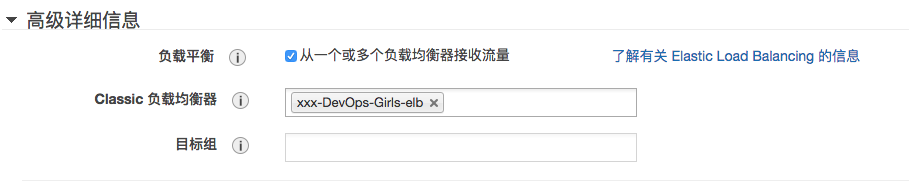
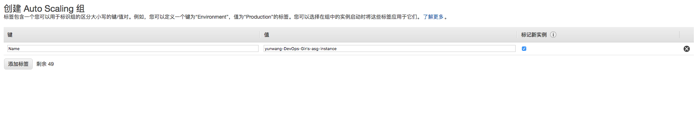
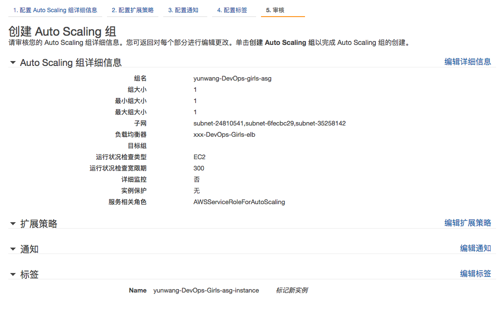
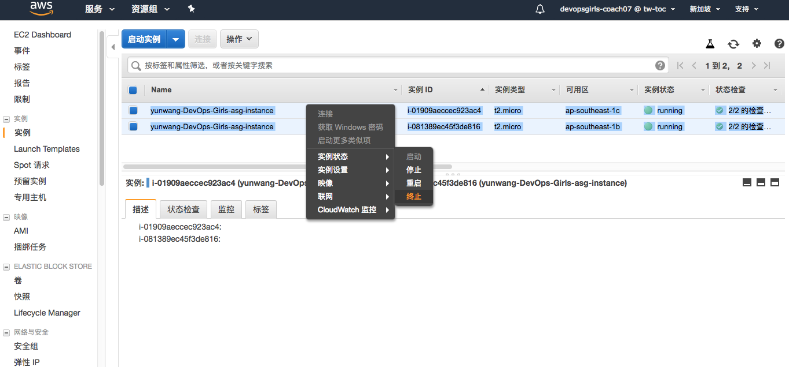
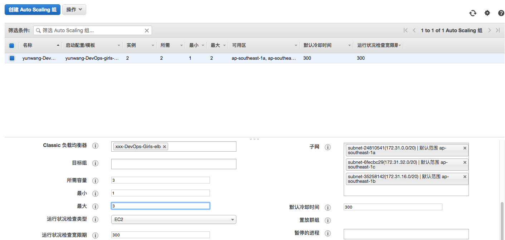
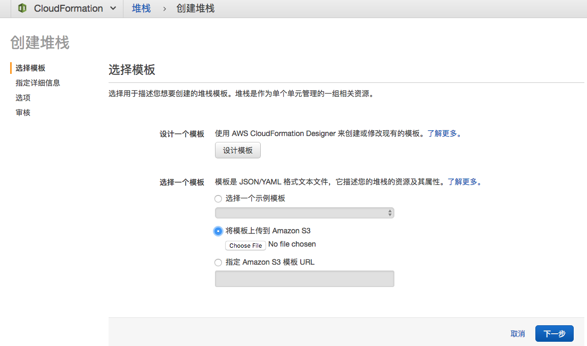
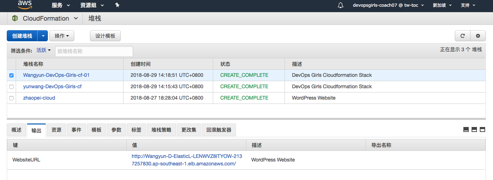

# 启动配置 和 Auto Scaling 组

## 关键概念

在我们开始之前, 我们先看几个关键概念

  - *启动配置 是你用来构建你的EC2实例的模板。* 也就是说，你可以用你配置EC2实例的方式去配置它, 唯一不同的是, 在配置它的过程中, 你不会真正的创建一个EC2实例, 你只是为它(们)画一个图纸。

  - *Autoscaling 组控制着你期望运行的实例的数量。* 它有很多种机制来实现对运行实例的控制:手动控制或者系统监测等。它和`启动配置`配合使用来自动创建/销毁实例。

好啦, 我们可以开始啦.

## 我们接下来要做些什么?

在这个实操课程中, 我们将会:

  - 创建一个启动配置

  - 用为EC2指定`用户数据`类似的方式为启动配置指定`用户数据`

  - 创建一个Autoscaling组

  - 配置Autoscaling组, 使其创建的实例可以关联到ELB上

  - 测试Autoscaling组

  - 基础设施及代码：尝试使用Cloudformation部署WordPress

## 创建一个启动配置

### 1.) 创建启动配置

跳转到服务 > EC2, 你能在左边菜单栏看到 *启动配置*. 点击 *创建启动配置*


### 2.) 设置启动配置将要使用的实例大小和AMI

我们使用配置EC2实例的方式来配置启动配置

```
 - AMI: Amazon Linux 2 AMI
 - Instance Type: t2.micro
```


### 3.) 配置启动配置其他细节

我们将要设置启动配置的其他细节, 先给它命名*你名字拼音-DevOps-girls-launchconfig*.


IAM角色直接选`无`

### 4.) 高级设置

在同一个配置界面, 点击 *高级详细信息*, 将下列内容粘贴到 *用户数据* 栏里面:

```bash
#!/bin/bash
yum install -y mysql php php-mysql httpd
aws s3 cp s3://devopsgirls-training-xian/你名字拼音-wordpress.tgz /var/www/wordpress.tgz --no-sign-request
tar xvfz /var/www/wordpress.tgz -C /var/www/html/
chown -R apache /var/www/html
service httpd start
```

**确保** 将 `你名字拼音-wordpress.tgz` 改名为你自己的名字, 或者你自己命名的Wordpress包名.


### 5.) 禁用公网IP

在同一个配置界面, 选择 *不向任何实例分配公有 IP 地址*. 这是一个非常重要的安全度量衡, 并且它将实例于公网分割开, 所有交互只能通过负载均衡.

进入下一个页面

### 6.) 设置存储

我们不需要修改存储配置, 所以我们把所有 *Add Storage* 中的配置保持默认


### 7.) Security Groups

我们将做和之前配置EC2实例一样的事. 在 *Protocol* 中选择 *HTTP*, 然后设置 *来源* 为 *"自定义 IP"*, 如果你输入你之前创建的负载均衡的名称, 它应该要出现在下拉列表里面


对于每一个我们创建的实例来说, 我们只接受来自 *我自己负载均衡器* 的http流量。

### 8.) 检查你的配置, 选择SSH密钥对

我们将在检查完配置以后完成启动配置 的创建, 确认一切都OK 以后, 点击
*创建启动配置*


和创建EC2 实例一样, 在最后会让你选择一个你之前创建好的SSH密钥对

## 创建一个AutoScaling 组

### 9.) 为你的启动配置创建一个Autoscaling 组

当你点击 *创建启动配置* 以后, 你应该能看到另外一个按钮: *使用此启动配置创建 Auto Scaling 组*. 点击它.


### 10.) Autoscaling 组详细配置

在下一个配置界面, 将GroupName 指定为 *你名字拼音-DevOps-Girls-asg*, 设置组大小为 *2*


### 11.) 选择网络和子网

在这次练习中, 我们将使用 *默认* VPC, 点击 *子网* 输入框, 你应该选择2-3个子网

`子网`的设置基本上决定了你的实例将在哪个`可用区`部署，你可以把`可用区`理解成`数据中心`, 数据中心将分布在一个`区域`的不同地点，另外保证你的服务的`高可用性`，在某个可用区挂掉的情况下为你的服务提供保障。

### 12.) 设置ELB

在同一个配置界面上点击 *高级详细信息*, 你能看到一个复选框 *负载平衡*. 这个选项可以让你把新创建的实例附属到负载均衡上.

一个额外的选择框应该会出现在页面上: *Classic Load Balancers*, 你应该可以选择你之前创建的ELB了。

### 13.）保持扩展策略的默认值

我们暂时不打算使用扩展策略 - 所以选择 *将此组保持在其初始大小*。请记住，您可以使用策略来监视实例的CPU或内存使用情况 - 例如，如果CPU的使用率超过70％，您可以选择自动添加更多实例。

### 14.）跳过通知

我们此时会选择不发送通知。可以将此视为一种通知某人是否发生事件的方式 - 例如，启动或删除实例。

### 15.）配置标签

与我们所做的任何事情一样，一旦创建它们就会标记我们要创建的实例。设置 *Name* 的键，并将值设置为`你名字拼音-DevOps-Girls-asg-instance`。



### 16.）检查，结束！

Review一下`启动配置`，没问题的话，单击*创建 Auto Scaling组*。


## 测试您的Autoscaling组：替换实例

现在，一切都应该准备好了！我们有*模板*用于创建实例，我们有*n*个实例要创建，所以让我们看看它是否正常工作！

### 17.）再次检查ELB

转到 *服务 > EC2 > 负载均衡器* 。选择您之前创建的负载均衡器（ *你名字拼音-DevOps-Girls-elb* ），然后查看说明。


### 18.）使用DNS名称访问ELB

复制DNS名称（类似于下面），并将其粘贴到浏览器中。你将访问到你的四个实例中的任何一个。


### 19.）销毁你的实例

转到 *服务 > EC2 > 实例*。在上面的搜索框中，您应该可以输入你名字的拼音。

对于所有属于你的实例，*右键单击 > 实例状态 > 终止*。



### 20.）检查你的ELB

刷新你的wordpress浏览器页面，应该会出现服务访问不到的问题。

### 21.）观看新实例的创建

在AWS控制台中，一分钟左右之后检查 *服务 > EC2 > 实例*。你应该能看到新创建出来的实例。


## 测试您的Autoscaling组：调整实例数量

现在我们知道实例正在自动替换，可以看到当我们更改Autoscaling组中的实例数时会发生什么。

### 22.）修改Autoscaling组配置

转到 *服务 > EC2 > Autoscaling*。查找你创建的Autoscaling组。
突出显示您创建的Autoscaling 组后，转到底部面板，然后单击 *编辑*。

- 将 *所需容量* 设置为3
- 将 *最大* 设置为3
- 单击 *保存*



### 23.）观察你创建的新实例

在AWS控制台中，每分钟左右检查 *服务 > EC2 > 实例*。你应该可以看到使用你配置创建的新实例。

恭喜你已经有了一个可以自动扩展的博客服务！

## 基础设施即代码

现在你已经完成了创建Autoscaling组的所有工作，现在是时候将它全部部署为代码了。基础设施即代码是DevOps中的一个重要思想 - 这可以确保基础架构可复用性，并且易于协作。

### 24.）下载Cloudformation模板

下载cloudformation模板[这里](devopsgirls-wordpress.yaml)。可以使用文本编辑器（记事本或类似的东西）打开它。

### 25.）阅读模板

需要注意的是，如果向下滚动，你所做的一切基本上都是逐行声明的。我知道它看起来很吓人，但不要担心！这只是你想要构建内容的声明。

### 26.）跳转到Cloudformation

转到 **服务> Cloudformation** 。单击 **创建堆栈**。

这将指向一个页面，可以在其中上传模板文件。点击 **下一步**。



### 27.）设置堆栈名称和参数

- 堆栈名称规则：`你名字拼音-DevOps-Girls-cf`
- 设置`DevopsGirlsUser`参数规则：`你名字拼音`

### 28.）跳过选项和审核，直接点击创建

### 29.）查看你的堆栈是否已创建

点击创建后，会自动跳转到 **服务 > Cloudformation**，查找之前你设置的堆栈名称。

在底部的对话框中，单击 *事件*。不停刷新它, 然后就能看到Cloudformation正在创建你的环境。


等你堆栈状态变为`CREATE_COMPLETE`，就代表创建成功，点击该堆栈的`输出`，找到并访问`WebsiteURL`的值，你将会访问到你刚才使用Cloudformation创建的WordPress了。

恭喜你已经成功使用基础设施代码完成部署！
