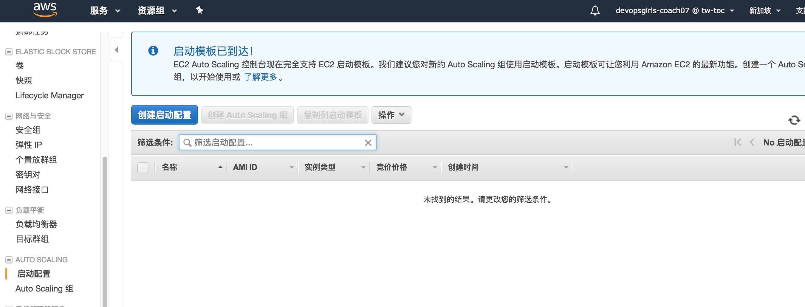
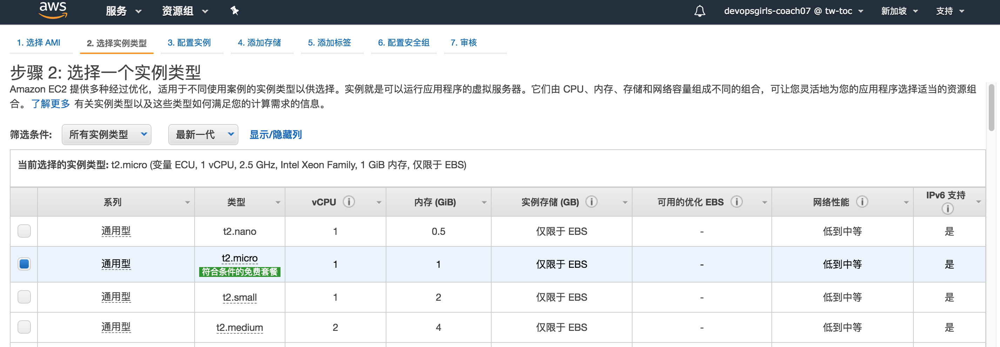
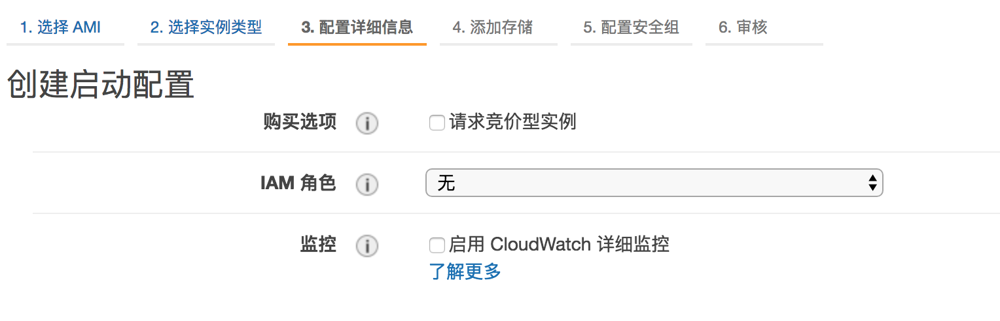
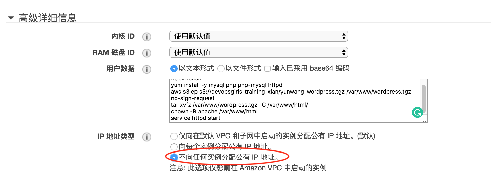
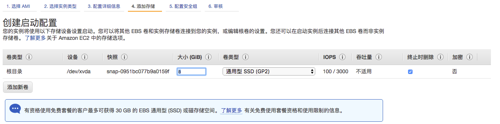
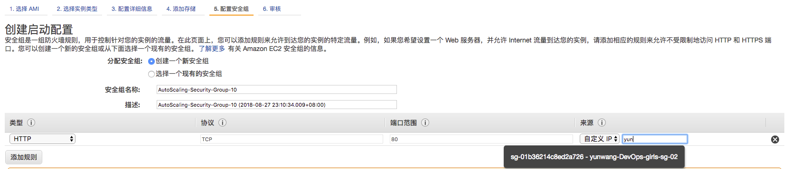
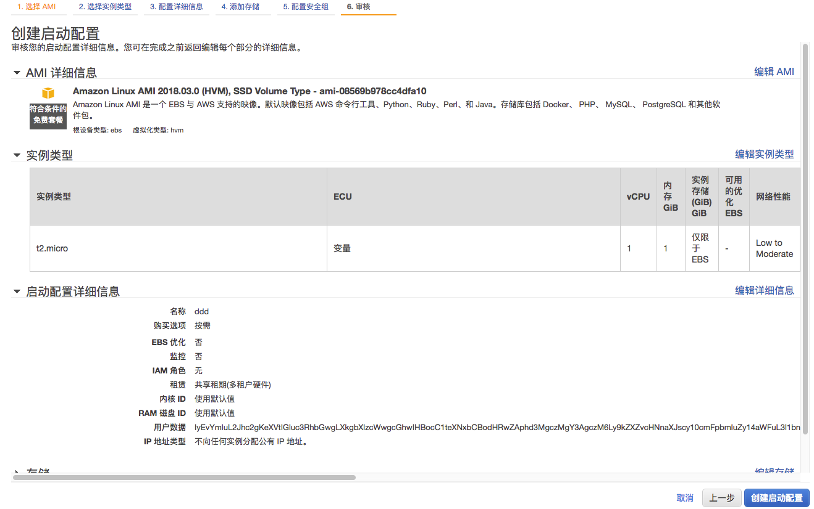
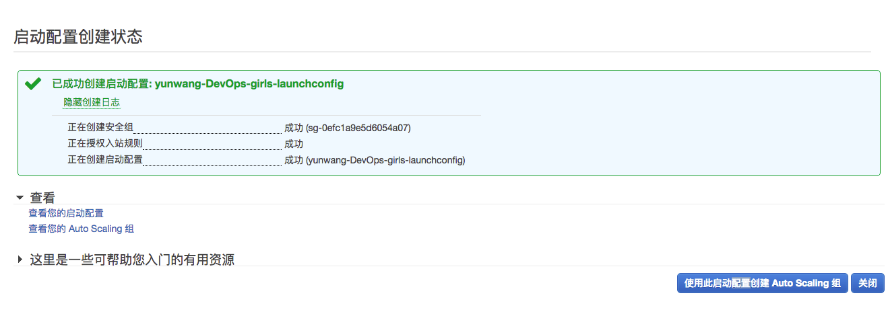
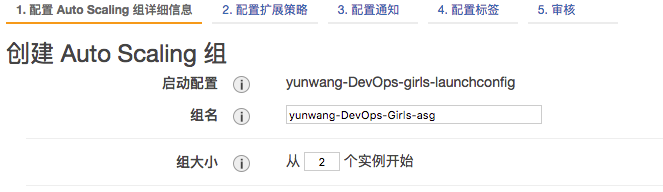
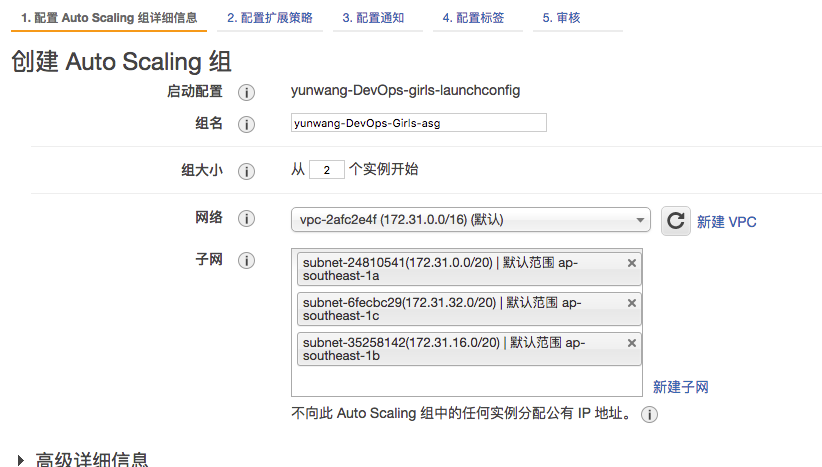

# 启动配置 和 Auto Scaling 组

## 关键概念

在我们开始之前, 我们先看几个关键的概念

  - *启动配置 是你用来构建你的EC2实例的模板.* 也就是说你可以用你配置EC2实例的方式去配置它, 唯一不同的是, 在配置它的过程中, 你不会真正的创建一个EC2 实例, 你只是为它(们)画一个图纸

  - *Autoscaling 组控制着你期望运行的实例的数量.* 它有很多种机制来实现对运行实例的控制:手动控制或者系统监测等. 它和`启动配置` 组合使用来自动创建/销毁实例.

好啦, 我们可以开始啦.

## 我们接下来要做些什么?

在这个实操课程中, 我们将会:

  - 创建一个启动配置

  - 用为EC2指定`用户数据`类似的方式为启动配置指定`用户数据`

  - 创建一个Autoscaling 组

  - 配置Autoscaling 组, 使其创建的实例可以关联到ELB上

  - 测试


## 创建一个启动配置


### 1.) 创建启动配置

跳转到服务 > EC2, 你能在左边菜单栏看到 *启动配置*. 点击 *创建启动配置*



### 2.) 设置启动配置将要使用的实例大小和AMI

我们使用配置EC2实例的方式来配置启动配置
```
 - AMI: Amazon Linux 2 AMI
 - Instance Type: t2.micro
```




### 3.) 配置启动配置其他细节

我们将要设置启动配置的其他细节, 先给它命名*你名字拼音-DevOps-girls-launchconfig*.



IAM角色直接选`无`

### 4.) 高级设置

在同一个配置界面, 点击 *高级详细信息*, 将下列内容粘贴到 *用户数据* 栏里面:

```bash
#!/bin/bash
yum install -y mysql php php-mysql httpd
aws s3 cp s3://devopsgirls-training-xian/你名字拼音-wordpress.tgz /var/www/wordpress.tgz --no-sign-request
tar xvfz /var/www/wordpress.tgz -C /var/www/html/
chown -R apache /var/www/html
service httpd start
```

**确保** 将 `你名字拼音-wordpress.tgz` 改名为你自己的名字, 或者你自己命名的Wordpress包名.




### 5.) 禁用公网IP

在同一个配置界面, 选择 *不向任何实例分配公有 IP 地址*. 这是一个非常重要的安全度量衡, 并且它将实例于公网分割开, 所有交互只能通过负载均衡.

进入下一个页面

### 6.) 设置存储
我们不需要修改存储配置, 所以我们把所有 *Add Storage* 中的配置保持默认




### 7.) Security Groups

我们将做和之前配置EC2实例一样的事. 在 *Protocol* 中选择 *HTTP*, 然后设置 *来源* 为 *"自定义 IP"*, 如果你输入你之前创建的负载均衡的名称, 它应该要出现在下拉列表里面



对于每一个我们创建的实例来说, 我们只接受来自 *我自己负载均衡器* 的http流量。

### 8.) 检查你的配置, 选择SSH密钥对

我们将在检查完配置以后完成启动配置 的创建, 确认一切都OK 以后, 点击
*创建启动配置*



和创建EC2 实例一样, 在最后会让你选择一个你之前创建好的SSH密钥对

## 创建一个AutoScaling 组

### 9.) 为你的启动配置创建一个Autoscaling 组

当你点击 *创建启动配置* 以后, 你应该能看到另外一个按钮: *使用此启动配置创建 Auto Scaling 组*. 点击它.




### 10.) Autoscaling 组详细配置
在下一个配置界面, 将GroupName 指定为 *你名字拼音-DevOps-Girls-asg*, 设置组大小为 *2*

### 11.) 选择网络和子网
在这次练习中, 我们将使用 *默认* VPC, 点击 *子网* 输入框, 你应该选择2-3个子网

子网的设置基本上决定了你的实例将在哪个可用区部署--可以把可用区理解成数据中心, 数据中心将分布在一个区域的不同地点, 你会需要很好的扩散性--这将在某个可用区挂掉的情况下为你的服务提供保障.

### 12.) 设置 Load Balancer

在同一个配置界面上点击 *高级详细信息*, 你能看到一个复选框 *负载平衡*. 这个选项可以让你把新创建的实例附属到负载均衡上.
![Image][3-1-11-elb]
一个额外的选择框应该会出现在页面上: *Classic Load Balancers*, 你应该可以选择你之前创建的负载均衡了.

### 13.）保持扩展策略的默认值
我们暂时不打算使用扩展策略 - 所以选择 *Keep this group at its initial size*。请记住，您可以使用策略来监视实例的CPU或内存使用情况 - 例如，如果CPU的使用率超过70％，您可以选择自动添加更多实例。

### 14.）跳过通知
我们此时会选择不发送通知。可以将此视为一种通知某人是否发生事件的方式 - 例如，启动或删除实例。

### 15.）配置标签
与我们所做的任何事情一样，一旦创建它们就会标记我们要创建的实例。设置 *Name* 的键，并将值设置为您的名称。

![Image][3-1-12-tags]

### 16.）检查，结束！

您应该会遇到一个部分，您可以在其中查看已发生的更改。准备好后，单击*create Auto Scaling group*，它应该开始被创建了。

![Image][3-1-13-review]

## 测试您的Autoscaling组：替换实例

现在，一切都应该准备好了！我们有 *blueprint* 用于创建实例，我们有 *count* 个实例要创建，所以让我们看看它是否正常工作！

### 17.）再次检查Load Balancer

转到 *Services > EC2 > Load Balancers* 。选择您之前创建的Load Balancer（ *myname-elb* ），然后查看说明。

![Image][3-1-14-elbinstances]

### 18.）使用DNS名称访问Load Balancer

复制DNS名称（类似于下面），并将其粘贴到浏览器中。你将访问到你的四个实例中的任何一个。

![Image][3-1-15-accesslb]

### 19.）杀死你的实例

转到 *Services > EC2 > Instances*。在上面的搜索框中，您应该可以输入您的姓名 - 允许您搜索使用您的姓名标记的任何实例。

对于所有四个实例，*Right-Click > Instance State > Terminate*。

![Image][3-1-16-killec2]

### 20.）检查您的ELB
检查粘贴Load Balancer的DNS名称的浏览器选项卡。它应该很快就会出现问题。

### 21.）观看新实例的创建
在AWS控制台中，每分钟左右检查 *Services > EC2 > Instances*。你应该看到的是，最终应该创建具有你名字的新实例。

![Image][3-1-17-instancereplace]

## 测试您的Autoscaling组：调整实例数量
现在我们知道您的实例正在自动替换，我们可以看到当我们更改Autoscaling Group中的实例数时会发生什么。

### 22.）修改您的Autoscaling组
转到 *Services > EC2 > Autoscaling Group*。查找您创建的Autoscaling组。
突出显示您创建的Autoscaling Group后，转到底部面板，然后单击 *Edit* 。将 *Desired Instances* 设置为3，将 *Max Instances* 设置为3.单击 *Save*。

![Image][3-1-18-setasg]

### 23.）观看新实例的创建

在AWS控制台中，每分钟左右检查 *Services > EC2 > Instances*。你应该看到的是，最终应该创建具有你名字的新实例。

恭喜！您已经有了一个可自动扩展的服务！

## 基础设施作为代码

现在您已经完成了创建自我修复扩展组的所有工作，现在是时候将它全部部署为代码了。作为代码的基础架构是DevOps中的一个重要思想 - 这可以确保您的基础架构可重复，并且易于协作。

### 24.）下载Cloudformation模板

下载cloudformation模板[这里](devopsgirls-wordpress.yaml)。您可以使用文本编辑器（记事本或类似的东西）打开它。

### 25.）阅读模板

需要注意的是，如果向下滚动，你所做的一切基本上都是逐行声明的。我知道它看起来很吓人，但不要担心！这只是你想要构建的内容的声明。

### 26.）跳转到Cloudformation

转到 **Services> Cloudformation** 。单击 **Create Stack**。

这将指向一个页面，您可以在其中上传模板文件。点击 **Next**。

![Image][3-1-19-upload]

### 27.）设置堆栈名称和参数

设置`DevopsGirlsUser`参数。使用您的`firstname.lastname`格式。

将`WordpressS3Bucket`更改为S3存储桶名称的名称 - 例如`devopsgirls-training-2`或`devopsgirls-training-3`，具体取决于您设置的帐号。

### 28.）查看，然后单击IAM资源

单击其余对话框，直到进入 **Review** 部分。在底部的文本框中显示“ *I acknowledge that AWS CloudFormation might create IAM resources*，勾选方框。

![Image][3-1-20-iam]

点击 *Create*.

### 29.）看看您的堆栈是否已创建

跳转到 **Services > Cloudformation** 并查找您之前设置的堆栈名称。在底部的对话框中，单击 *Events*。不时刷新它, 然后你就能看到你的环境正在被创建

恭喜你, 你已经实现代码的部署了.

[3-1-10-subnets]: https://raw.githubusercontent.com/DevOpsGirls/devopsgirls-bootcamp/master/images/3-1-ASG/3-1-10-subnets.png
[3-1-11-elb]: https://raw.githubusercontent.com/DevOpsGirls/devopsgirls-bootcamp/master/images/3-1-ASG/3-1-11-elb.png
[3-1-12-tags]: https://raw.githubusercontent.com/DevOpsGirls/devopsgirls-bootcamp/master/images/3-1-ASG/3-1-12-tags.png
[3-1-13-review]: https://raw.githubusercontent.com/DevOpsGirls/devopsgirls-bootcamp/master/images/3-1-ASG/3-1-13-review.png
[3-1-14-elbinstances]: https://raw.githubusercontent.com/DevOpsGirls/devopsgirls-bootcamp/master/images/3-1-ASG/3-1-14-elbinstances.png
[3-1-15-accesslb]: https://raw.githubusercontent.com/DevOpsGirls/devopsgirls-bootcamp/master/images/3-1-ASG/3-1-15-accesslb.png
[3-1-16-killec2]: https://raw.githubusercontent.com/DevOpsGirls/devopsgirls-bootcamp/master/images/3-1-ASG/3-1-16-killec2.png
[3-1-17-instancereplace]: https://raw.githubusercontent.com/DevOpsGirls/devopsgirls-bootcamp/master/images/3-1-ASG/3-1-17-instancereplace.png
[3-1-18-setasg]: https://raw.githubusercontent.com/DevOpsGirls/devopsgirls-bootcamp/master/images/3-1-ASG/3-1-18-setasg.png
[3-1-19-upload]: https://raw.githubusercontent.com/DevOpsGirls/devopsgirls-bootcamp/master/images/3-1-ASG/3-1-19-upload.png
[3-1-18-iam]: https://raw.githubusercontent.com/DevOpsGirls/devopsgirls-bootcamp/master/images/3-1-ASG/3-1-20-iam.png
[3-1-20-iam]: https://raw.githubusercontent.com/DevOpsGirls/devopsgirls-bootcamp/master/images/3-1-ASG/3-1-20-iam.png
[3-1-2-instancetype]: https://raw.githubusercontent.com/DevOpsGirls/devopsgirls-bootcamp/master/images/3-1-ASG/3-1-2-instancetype.png
[3-1-3-iamrole]: https://raw.githubusercontent.com/DevOpsGirls/devopsgirls-bootcamp/master/images/3-1-ASG/3-1-3-iamrole.png
[3-1-4-userdata]: https://raw.githubusercontent.com/DevOpsGirls/devopsgirls-bootcamp/master/images/3-1-ASG/3-1-4-userdata.png
[3-1-5-storage]: https://raw.githubusercontent.com/DevOpsGirls/devopsgirls-bootcamp/master/images/3-1-ASG/3-1-5-storage.png
[3-1-6-secgroups]: https://raw.githubusercontent.com/DevOpsGirls/devopsgirls-bootcamp/master/images/3-1-ASG/3-1-6-secgroups.png
[3-1-7-reviewlc]: https://raw.githubusercontent.com/DevOpsGirls/devopsgirls-bootcamp/master/images/3-1-ASG/3-1-7-reviewlc.png
[3-1-8-createsgh]: https://raw.githubusercontent.com/DevOpsGirls/devopsgirls-bootcamp/master/images/3-1-ASG/3-1-8-createsgh.png
[3-1-9-asgname]: https://raw.githubusercontent.com/DevOpsGirls/devopsgirls-bootcamp/master/images/3-1-ASG/3-1-9-asgname.png
[3-1-ASG]: https://raw.githubusercontent.com/DevOpsGirls/devopsgirls-bootcamp/master/images/3-1-ASG/3-1-ASG.png
[3-1-createlcfg]: https://raw.githubusercontent.com/DevOpsGirls/devopsgirls-bootcamp/master/images/3-1-ASG/3-1-createlcfg.png
